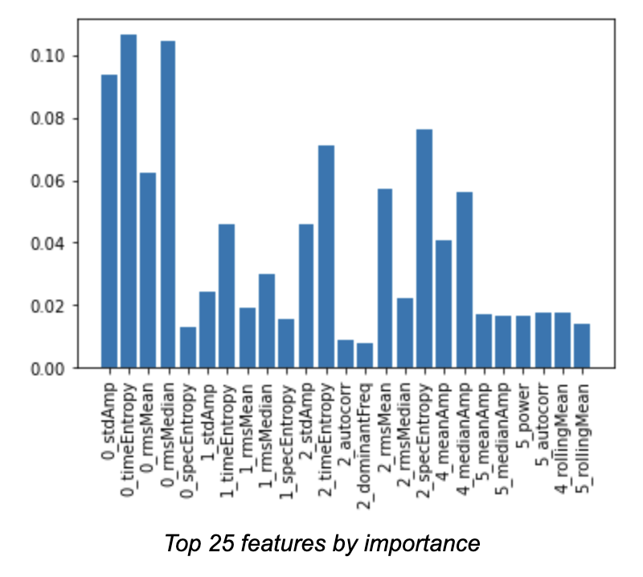
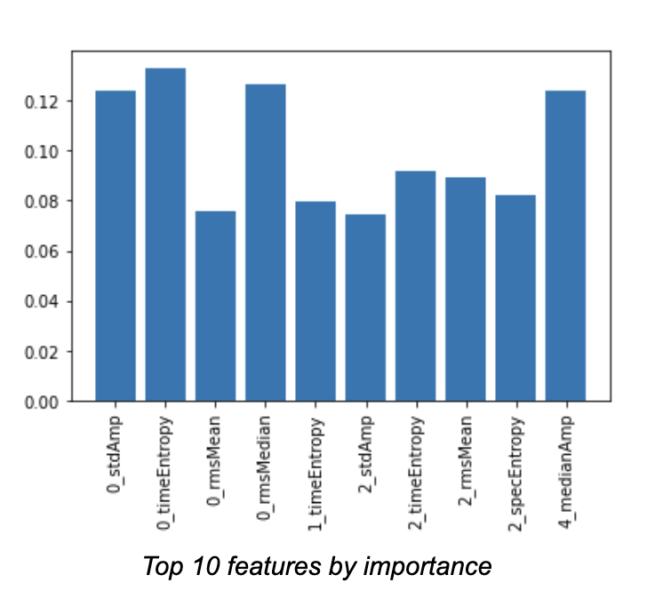

# HypnoTech - Sleep Stage Machine Learning Model

This machine learning model based on the random forest algorithm was developed at Rice University's 6th Datathon to to unlock critical insights into sleep patterns while alleviating the need for manual sleep stage classifications by physicians. By extracting influential features from six channels, HypnoTech can predict a patient’s current sleep stage.  

:trophy: Neurotech Track - 2nd

## How we built it

### Data Wrangling
We began by transforming the given 3D array into a 2D pandas dataframe, for easier data manipulation and wrangling. Next, we cleaned the data set of epochs that were not scored. Then, we visualized the distribution of the remaining sleep stages in a histogram. We noticed that there was a significantly higher number of waking sleep stages leading to an unbalanced dataset. To prevent the negative effects of training a machine learning model on an unbalanced dataset, we used undersampling to balance the dataset. We chose the ‘auto’ sampling strategy to avoid adding excessive duplicate epochs and to also avoid removing important characteristics.  

Next, we created exploratory data visualizations to better understand the data set. By graphing the signal from each channel for each sleep stage at a randomly selected epoch, we noted the shape of the signal at different stages to brainstorm possible features to extract. We also filtered our 50 Hz using a notch filter from the electrical channels i.e. EEG Fpz-Cz, EEG Pz-Cz, and EOG to reduce any possible power line noise.

Looking at these plots gave us a good idea about the nature of these signals – the first three are far more electrical and noisy while the next 3 are definitely more smooth. We also then decided to plot the frequency spectrogram of the signals that exhibited potential to get some ideas of features we could create in the frequency domain. 

After completing this initial data wrangling, we began feature engineering. We explored creating features of almost anything we could think of. Running calculations on each epoch of 3000 samples, we developed 12 features per channel – A total of 72 features:

Time-domain Features
* Mean Amplitude - Simply a measure of the average amplitude of the signal in the given epoch.
* Median Amplitude - The median amplitude of the signal in the given epoch.
* Standard Deviation of Amplitude - How much the signal deviates from the mean amplitude in the epoch.
* Time Entropy - Used Shannon Entropy; Tells us how disordered or unpredictable the signal is.
* Signal Power - Gives us an idea of the relative strength of the signal in the given epoch, takes into account amplitude and duration.
* Signal Energy - Gives an idea of signal intensity over the entire duration.

Frequency-domain Features
* Dominant Frequency - Tells us the most common frequency present in the signal during this epoch. 
* Signal RMS w/ Mean - Calculated using the mean with Welch’s method to get the Power Spectral Density (PSD)
* Signal RMS w/ Median - Calculated using the median with Welch’s method to get the Power Spectral Density (PSD)
* Spectral Entropy - Used Shannon Entropy; Tells us how disordered or unpredictable the signal is in the frequency domain.

Temporal Features
* Autocorrelation - How much does the signal relate to a delayed version of itself; i.e, does it exhibit patterns or periodicity?
* Rolling Mean - An aggregate mean amplitude measure using feature 1 and calculating a new mean per epoch based on previous values.

We then visualized the correlation between all features (so much to look at!) and then each feature within a channel.

This told us that no one feature was really heavily correlated with the sleep stage label. I also found it quite interesting that power, energy, and autocorrelation were so related.

With this step completed, we split the dataset into a X_data dataframe with features and a y_data containing the labels we want to predict.

### Creating our model

To select the most optimal machine learning model, we tried various classification algorithms using the scikit-learn library. First, we trained a K-nearest neighbors classifier. Using a test-train split with a fixed random_state, our models had accuracy scores around 0.70. Then, to mitigate the impact of using a test-train split, we used K-fold cross validation and optimized the k-value for the number of neighbors. Second, we trained a stochastic gradient descent classifier using a linear SVM loss function on a standard scaled version of our dataset. Once more, we had accuracy scores around 0.75. Finally, we trained a random forest classifier. Using a random search cross validation approach with 10 iterations, we fine tuned the ‘max_depth’ and ‘min_samples_leaf’ hyperparameters. This allowed us to balance computational efficiency with appropriately training, but not overfitting the data. Comparing our three models, we chose the random forest classifier as our final model. The random forest classifier gave us the highest accuracy and unlike the SGD classifier, utilized the cross validation approach. Cross validation allows our model to have less dependence on the random split of training and test data.

### Feature Selection

Finally, we conducted analysis on feature importance to select the most influential features to train our model. We plotted the percent contributions against each feature and noted that ten features had a percent contribution greater than 70%. Further, the top 25 features accounted for 99% of the decisions in the model. By reducing the features used in training the model to only those features with the largest 25 contributions, we are able to create a more efficient model that clearly communicates the factors that have an impact on sleep stages. 

### Challenges we ran into 
This project consisted of a lot of firsts for our team, which came with its challenges. For one, this was our first time working with 3D data so we had a rough start as we approached formatting the data for use in visualizations and models. Another challenge was wrangling with the huge amount of data. This often cost a big runtime for whenever we wanted to set up our dataframe with all the data we have available or whenever we wanted to train our models with the data. As this process was time consuming, debugging and testing different combinations and tunings on models was quite difficult. Yet another challenge we encountered was integration. As we had three team members, we each worked on parts of the project separately and simultaneously. Integrating all the different code components took several iterations of debugging and discussion. 

### Accomplishments that we're proud of
We are proud of how we tried numerous different approaches for data pre-processing. We attempted to scale the data, to balance the data, and even tried our hand at DSP. This track was so exciting because there are so many interesting aspects of working with signals that we were able to research and apply to our project. Furthermore, we not only tried implementing 2-3 different machine learning models 

### What we learned
We are most proud of our learning through this journey. Some of us even started out this datathon without a clear understanding of what a feature is. However, by the end of this datathon, we are very proud to have a solid foundation in the data science pipeline, from exploration, to wrangling and preprocessing, and to iterating on our model. 

### What's next for HypnoTech
We hope to improve HypnoTech model accuracy by fine tuning various aspects of the development process. This includes comparing various methods of balancing data. For example, selectively removing wake epochs near the beginning or end of a series of waking epochs could balance data while minimizing loss of characteristics. Further, we hope to develop a more robust model. Due to our computational efficiency, training and testing with all 23 patient’s data was costly on our devices, and we had to opt for using a subset of the provided data. Looking forward and with more time, we’d love to develop our model with all of the data provided to get the best results. Overall, we are incredibly excited about our project and so happy to have this platform to share.
